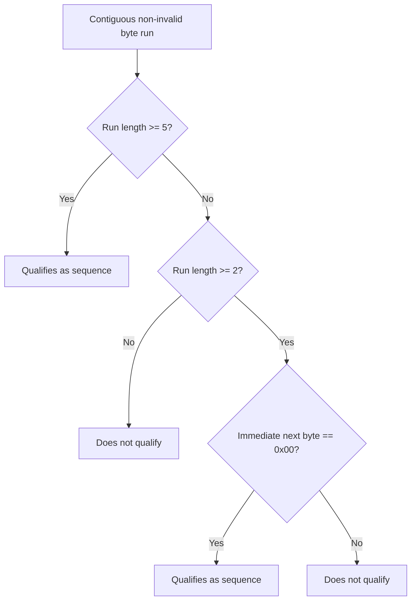
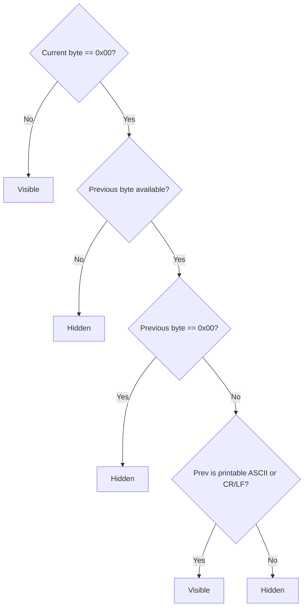

# Behavioral Invariants and Edge Cases (Current Implementation)

This file records behavior that is currently enforced by code and/or tests.

## Matching and Text Interpretation

- `MatchUtils::indexOf(...)` applies ignore-case folding only for non-UTF-16 modes.
  - For UTF-16 mode, it delegates to exact `QByteArray::indexOf`.
- Ignore-case folding is ASCII-only (`A-Z` -> `a-z`) and byte-based.
- Ignore-case path rejects empty needles (`-1`).

Evidence:
- `src/scan/MatchUtils.cpp`
- `tests/unit_tests.cpp` (`testMatchUtilsIndexOf`)

## Text Sequence Detection Rules

`TextSequenceAnalyzer::finalizeSequences(...)` marks a sequence when either:

- contiguous non-invalid run length >= 5
- contiguous non-invalid run length >= 2 and immediately followed by `0x00`

This applies after mode-specific classification (ASCII/UTF-8/UTF-16).

Evidence:
- `src/text/TextSequenceAnalyzer.cpp`
- `tests/unit_tests.cpp` (`testTextSequenceAnalyzer`)

## String Mode Null Visibility

`StringModeRules` behavior:

- NUL rendering is denied when there is no predecessor byte.
- NUL rendering is denied when predecessor is `0x00`.
- NUL rendering is allowed only if predecessor is:
  - printable ASCII (`0x20..0x7E`)
  - `\r` or `\n`
- For first byte in a viewport, predecessor can come from backing byte before viewport start.

Evidence:
- `src/text/StringModeRules.cpp`
- `tests/unit_tests.cpp` (`testStringModeNullVisibilityRule`)

## Scan Lifecycle Guardrails

- A scan cannot start if:
  - another scan is running
  - search term is empty
  - filtered target list is empty
- Worker count is always at least `1`.
- Block size is always at least `1`.
- Stop requests are cooperative (atomic flag + CV wake); no forced thread termination.

Evidence:
- `src/scan/ScanController.cpp`
- `src/app/MainWindow.cpp`

## Partition and Merge Guarantees

- Reader creates job segments with explicit overlap to prevent missing boundary matches.
- Partition validity is checked and warnings logged on invalid splits.
- Final merge guarantees ordered output by:
  - fast k-way merge when per-worker streams are sorted
  - fallback global sort when stream order contract is broken

Evidence:
- `src/scan/ScanController.cpp` (`readerLoop`, `buildFinalResults`)

## Result Buffer and Cache Invariants

- Every result row has an index in `m_matchBufferIndices`.
- Evicted buffers become placeholders with stable `scanTargetIdx` and `fileOffset`.
- On-demand load restores bytes for a row and re-enforces cache budget.
- Cache eviction policy prefers largest resident buffer; tie-breaker least referenced.
- Protected buffer indices are never evicted in that enforcement pass.

Evidence:
- `src/app/MainWindow.cpp` (`evictOneBufferLargestFirstLeastUsed`, `ensureRowBufferLoaded`)

## Preview Synchronization Invariants

- Shared center offset is always clamped to current backing buffer bounds.
- Center requests are coalesced through queued updates to avoid re-entrancy storms.
- Text/bitmap updates run under `m_previewSyncInProgress` guard.
- Hover decode uses only the currently rendered hover buffers (text or bitmap side).

Evidence:
- `src/app/MainWindow.cpp` (`scheduleSharedPreviewUpdate`, `updateSharedPreviewNow`)

## Result Model Contract

- Table currently has exactly 4 columns:
  1. `Thread`
  2. `Filename`
  3. `Offset`
  4. `Search time`
- Offset display is rounded humanized units (`B`, `KiB`, `MiB`, ...).
- Search time display is `elapsedNs / 1_000_000` in milliseconds.

Evidence:
- `src/model/ResultModel.cpp`
- `tests/unit_tests.cpp` (`testResultModelColumnOrder`)

## Persistence Invariants

`AppSettings` persists and rehydrates:

- last file dialog path
- last directory dialog path
- text byte/string mode
- text wrap mode
- text monospace mode
- newline mode combo index
- byte line mode combo index
- prefill-on-merge toggle

Settings are saved immediately at control-change call sites (no delayed batch commit).

Evidence:
- `src/settings/AppSettings.cpp`
- `src/app/MainWindow.cpp` constructor + control handlers

## Error Handling Invariants

- User-facing scan errors are signaled and surfaced via `QMessageBox::warning`.
- Many operational faults are non-fatal and logged (stderr/stdout), including:
  - chunk read failure
  - invalid partition warning
  - invalid worker callback id
  - stream-order fallback warning
- On-demand preview load failure does not crash; preview update just returns.

Evidence:
- `src/scan/ScanController.cpp`
- `src/app/MainWindow.cpp`

## Notable Doc/Implementation Mismatches

Compared with `README.md`, current code indicates:

- Results table columns are currently 4, not the larger column set described in README.
- The README caveat says scan auto-stops when merged results exceed `4000`, but there is no corresponding stop-limit logic in current `ScanController` or `MainWindow` runtime path.

These are documentation drift points and should be treated as current-behavior discrepancies.
