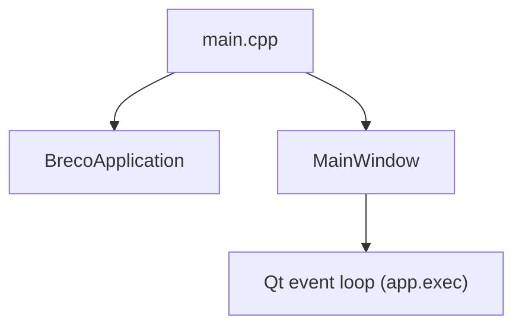
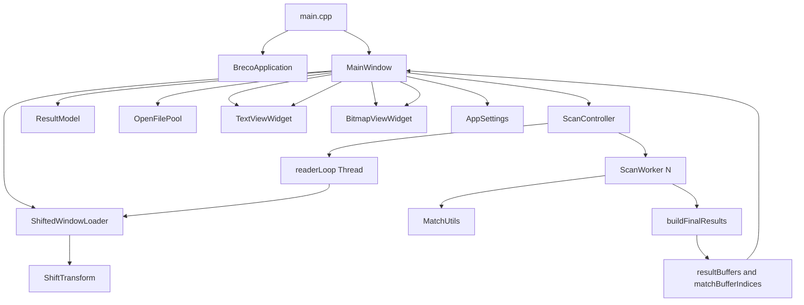

# Core Runtime Codemap (Current Implementation)

This map documents the runtime structure as implemented in the current codebase.

## Entrypoints and Executables

- App entrypoint: `src/main.cpp`
  - `main()` creates `BrecoApplication`, then `breco::MainWindow`, then enters `app.exec()`.
  - `BrecoApplication::notify()` wraps Qt event dispatch and emits slow/in-progress trace logs when selection tracing is enabled.
- Test and benchmark executables are built separately in `CMakeLists.txt` and are not part of runtime app flow:
  - `breco_unit_tests` from `tests/unit_tests.cpp`
  - `breco_text_analysis_benchmark` from `tests/text_analysis_benchmark.cpp`
  - `breco_scan_primitives_benchmark` from `tests/scan_primitives_benchmark.cpp`

### Startup Path Diagram

## Top-Level Runtime Modules

### `src/app`

- `MainWindow` is the orchestration hub for UI, scan lifecycle, result model updates, preview synchronization, and status output.
- Owns/coordinates:
  - `ResultModel` (`src/model`)
  - `OpenFilePool` + `ShiftedWindowLoader` (`src/io`)
  - `ScanController` (`src/scan`)
  - View panels and widgets (`src/panel`, `src/view`)
  - `AppSettings` interactions (`src/settings`)

### `src/scan`

- `ScanController` owns scan lifecycle and worker topology.
  - Starts/stops scan runs, launches reader thread and `ScanWorker` pool.
  - Partitions buffers into jobs with overlap for boundary-safe matching.
  - Merges worker-local matches, then builds `ResultBuffer` clusters or placeholders.
- `ScanWorker` executes pattern matching over assigned `ScanJob` segments.
- `MatchUtils` provides byte matching helpers.
- `ShiftTransform` provides shifted output mapping and transform logic.
- `ScanTypes` defines shared scan job/buffer types.
- `SpscQueue` exists as a primitive utility (used by tests; not a central `ScanController` runtime queue).

### `src/io`

- `FileEnumerator` converts user-selected file/dir input into candidate file lists.
- `OpenFilePool` provides thread-local file handle reuse and bounded per-thread LRU.
- `ShiftedWindowLoader` uses `OpenFilePool` and `ShiftTransform` to load transformed windows.

### `src/model`

- `ResultModel` is a `QAbstractTableModel` wrapper over `QVector<MatchRecord>`.
- Current columns are exactly:
  - `Thread`
  - `Filename`
  - `Offset` (approximate humanized units)
  - `Search time` (milliseconds)

### `src/view`

- `TextViewWidget` renders byte/text data and emits hover/center/selection/backing-scroll signals.
- `BitmapViewWidget` renders bitmap modes and emits hover/byte-click signals.

### `src/panel`

- UI panel wrappers expose controls/widgets used by `MainWindow`:
  - `ScanControlsPanel`
  - `ResultsTablePanel`
  - `TextViewPanel`
  - `CurrentByteInfoPanel`
  - `BitmapViewPanel`

### `src/text`

- `TextSequenceAnalyzer` and `StringModeRules` implement text classification and sequence heuristics used by text-oriented rendering behavior.

### `src/settings`

- `AppSettings` is a static wrapper around `QSettings` for persisted UI preferences and dialog paths.

### `src/debug`

- `SelectionTrace` controls trace logging used by `MainWindow` and `BrecoApplication` for event/selection diagnostics.

## Ownership and Dataflow Graph

## Critical Runtime Symbols by Concern

- Startup/event tracing:
  - `main()`, `BrecoApplication::notify()`, `BrecoApplication::startWatchdogIfNeeded()`
- Scan lifecycle:
  - `MainWindow::onStartScan()`, `MainWindow::onStopScan()`
  - `ScanController::startScan()`, `ScanController::readerLoop()`, `ScanController::onTick()`
- Result merge/storage:
  - `ScanController::buildFinalResults()`, `ScanController::buildResultBuffers()`
- UI result/preview:
  - `MainWindow::onResultsBatchReady()`, `MainWindow::onResultActivated()`
  - `MainWindow::updateSharedPreviewNow()`
- Cache/reload:
  - `MainWindow::enforceBufferCacheBudget()`
  - `MainWindow::evictOneBufferLargestFirstLeastUsed()`
  - `MainWindow::ensureRowBufferLoaded()`
- Persistence:
  - `AppSettings::*`, called from `MainWindow` constructor and control-toggle handlers

## UI Resource Mapping

Qt UI resources are listed in `CMakeLists.txt` and materialized under `ui/`:

- `ui/MainWindow.ui`
- `ui/ScanControlsPanel.ui`
- `ui/ResultsTablePanel.ui`
- `ui/TextViewPanel.ui`
- `ui/CurrentByteInfo.ui`
- `ui/BitmapViewPanel.ui`

## UI Designer Naming Paradigm

For Qt Designer `.ui` files, widget names indicate whether code should depend on them:

- Designer-generated names (for example `label_3`, `label_5`) indicate widgets with no operational consequence.
  - These can be replaced or regenerated without requiring source-code updates.
  - Keep these generated names unchanged unless the widget later needs programmatic interaction.
- Meaningful names begin with a type prefix and semantic identifier (for example `lblAsciiValue`).
  - These names indicate widgets intended for code interaction (for example setting text/value, toggling visibility, wiring behavior).
  - Treat these names as part of the UI-to-code contract.
