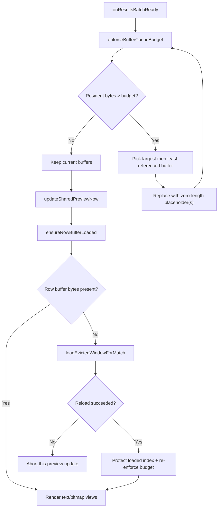
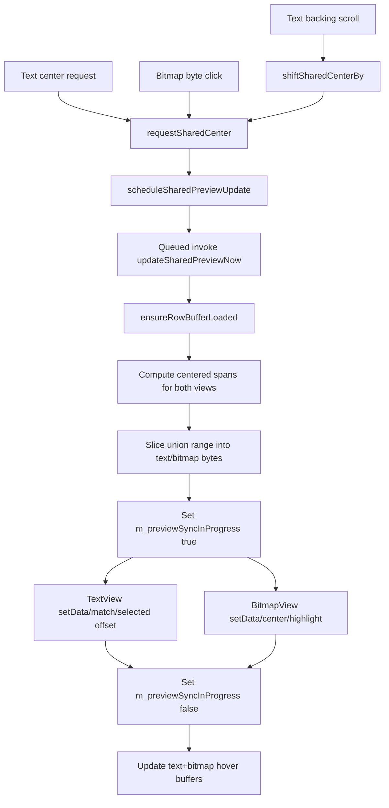

# Preview, Cache, and Status Behavior (Current Implementation)

This document details preview rendering, cache behavior, and hover/status decoding as currently implemented in `MainWindow`.

## Core State Used by Preview/Cache

Primary `MainWindow` fields:

- `m_resultBuffers`: backing byte windows for result rows
- `m_matchBufferIndices`: row -> buffer index mapping
- `m_activePreviewRow`: currently previewed result row
- `m_sharedCenterOffset`: synchronized center offset for text and bitmap views
- `m_pendingCenterOffset`: deferred center request waiting for next update tick
- `m_previewSyncInProgress`: recursion guard while pushing view updates
- `m_previewUpdateScheduled`: queued-update coalescing guard
- `m_textHoverBuffer` / `m_bitmapHoverBuffer`: last rendered byte windows for status decode

Constants:

- `kResultBufferCacheBudgetBytes = 2048 MiB`
- `kEvictedWindowRadiusBytes = 8 MiB`
- `kNotEmptyInitialBytes = 16 MiB`

## Result Buffer Population Modes

Source: `ScanController::buildResultBuffers()` and `MainWindow::onResultsBatchReady()`.

- Prefill enabled:
  - scan merge path loads clustered windows immediately.
- Prefill disabled:
  - scan merge path creates zero-length placeholders per row.

`MainWindow` always receives current buffers and mapping in `onResultsBatchReady()` and then enforces local cache budget.

## Cache Budget Enforcement

`MainWindow::enforceBufferCacheBudget()`:

1. computes resident bytes from buffers that are still referenced by any row
2. while resident > budget:
   - calls `evictOneBufferLargestFirstLeastUsed(protectedSet)`
   - increments eviction count
3. stops if no candidate can be evicted

### Eviction policy

`evictOneBufferLargestFirstLeastUsed()` chooses candidate by:

- largest resident `bytes.size()`
- tie-breaker: fewer row references first
- optional protected indices are never evicted in that pass

Replacement strategy:

- if candidate has no mapped rows: clear bytes in place
- if mapped rows exist:
  - first affected row keeps original index with placeholder buffer
  - each additional affected row is remapped to a newly appended placeholder buffer

Placeholder format (`makeEvictedPlaceholderBuffer()`):
- `scanTargetIdx = match.scanTargetIdx`
- `fileOffset = match.offset`
- `bytes = empty`

This guarantees row-to-buffer mapping remains valid even after heavy eviction.

## On-Demand Reload Path

When active row buffer is empty, `updateSharedPreviewNow()` calls:

- `ensureRowBufferLoaded(row, match, protectedIndices)`

`ensureRowBufferLoaded()`:

1. validates row and mapped buffer index
2. if bytes already resident -> success
3. otherwise calls `loadEvictedWindowForMatch(match)`
4. if load succeeded, replaces placeholder with loaded window
5. immediately re-runs cache budget enforcement with newly loaded index protected

`loadEvictedWindowForMatch()` behavior:

- validates target index/path/size
- computes reload range:
  - start = `match.offset - 8MiB` clamped to 0
  - end = `match.offset + termLen + 8MiB` clamped to file size
- uses **stored scan-time shift settings** (`m_resultShiftSettings`) when available, otherwise current controls
- loads transformed bytes with `ShiftedWindowLoader::loadTransformedWindow(...)`
- returns populated `ResultBuffer` or empty result on failure

Failures are non-fatal:
- preview update returns early when buffer cannot be loaded
- app continues running

## Shared-Center Preview Synchronization

Two-way synchronization mechanism:

- text view can request center (`centerAnchorOffsetChanged`)
- bitmap view byte-click requests center
- wheel backing-scroll in text view shifts center by computed byte delta

All center requests funnel through:
- `requestSharedCenter(absoluteOffset)` -> sets pending center -> schedules update

Deferred update:
- `scheduleSharedPreviewUpdate()` posts queued lambda and coalesces bursts.

Actual render:
- `updateSharedPreviewNow()`
  - validates active row + match + backing buffer
  - resolves center from pending/current and clamps to buffer bounds
  - computes `textSpan` and `bitmapSpan` using view-reported capacities
  - slices one union range to build per-view byte arrays
  - pushes data/highlights into both widgets
  - updates hover buffers

Re-entrancy protection:
- `m_previewSyncInProgress` suppresses text-center echo loops during widget updates.

## Viewport and Span Computation

Functions:

- `textViewportByteWindow()`: uses `TextViewWidget::recommendedViewportByteCount()`
- `bitmapViewportByteWindow()`: uses `BitmapViewWidget::viewportByteCapacity()`
- `centeredSpan(buffer, center, desiredWindow)`
- `clampViewportStart(...)`
- `viewportFromStart(...)`
- `previousByteBeforeViewport(...)`

Key behavior:
- spans are always clamped inside current backing buffer
- center offset is bounded to `[bufferStart, bufferEnd-1]`
- one byte before viewport (when available) is passed to text widget for string-mode null visibility decisions

## Initial Non-Empty Preview for Single File

`loadNotEmptyPreview()` is invoked after open-file flow:

- only runs in single-file mode with one target and non-zero file size
- loads up to `16MiB` transformed bytes from file offset `0`
- creates synthetic match row at offset `0`
- clears previous cache state and installs single backing buffer
- rebuilds intervals and auto-selects row 0 to render preview

This provides immediate preview context before the user runs an explicit scan.

## Hover and Status-Line Decode Path

Signal handling:

- text hover -> `onTextHoverOffsetChanged()`
  - mirrors hover into bitmap view (`setExternalHoverOffset`)
  - decodes status from text hover buffer
- bitmap hover -> `onBitmapHoverOffsetChanged()`
  - decodes status from bitmap hover buffer
- hover leave -> `onHoverLeft()`
  - clears bitmap external hover
  - writes `Hover: -`

Formatting path:
- `updateStatusLineFromHover(...)` validates range and calls
- `formatHoverValueLine(filePath, absoluteOffset, windowData, relativeIndex)`

Decoded fields include:

- ASCII printable/substitution
- UTF-8 and UTF-16 glyph attempts
- unsigned little-endian integer reads (8/16/32/64-bit)
- float from 32-bit payload
- double from 64-bit payload

Output suppression:
- `writeStatusLineToStdout()` avoids duplicate consecutive lines by comparing with `m_lastStatusLineText`.

## Overlap Interval Side Channel to Bitmap

`rebuildTargetMatchIntervals()` creates per-target `[start,end)` intervals from all matches using term length.

`onResultActivated()` applies intervals when selected target changes:
- `m_bitmapView->setOverlapIntervals(...)`
- updates `m_activeOverlapTargetIdx`

This is independent of cache residency and persists as long as result model state is present.
