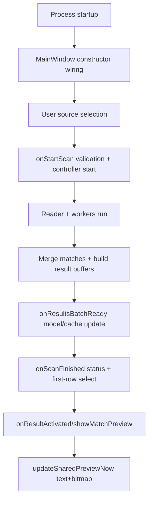

# Runtime Behavior (Current Implementation)

This document describes runtime behavior exactly as currently implemented.

## End-to-End Lifecycle

## 1) Process Startup

1. `main()` (`src/main.cpp`) constructs `BrecoApplication`.
2. `main()` constructs `breco::MainWindow` and calls `show()`.
3. Qt event loop begins with `app.exec()`.

If selection tracing is enabled, `BrecoApplication::notify()` wraps event delivery, records event metadata, and logs:
- slow completions above `BRECO_EVENTTRACE_SLOW_MS` (default `50ms`)
- in-progress events at repeat interval `BRECO_EVENTTRACE_REPEAT_MS` (default `250ms`)

## 2) Main Window Construction and Wiring

`MainWindow::MainWindow()` (`src/app/MainWindow.cpp`) performs:

- UI host setup (`m_ui->setupUi(this)`)
- panel creation and layout embedding:
  - `ScanControlsPanel`
  - `ResultsTablePanel`
  - `TextViewPanel`
  - `CurrentByteInfoPanel`
  - `BitmapViewPanel`
- view widget creation:
  - `TextViewWidget`
  - `BitmapViewWidget`
- result table model attach (`ResultModel`)
- signal/slot wiring between controls, views, and scan controller
- initial defaults and persisted settings load from `AppSettings`
- summary/status initialization

Notable startup behavior:
- Worker-count control is populated from `1..QThread::idealThreadCount()`.
- Bitmap zoom initializes to `1x`.
- Shift defaults to bytes mode with value `0`.
- If file context later becomes single-file, `loadNotEmptyPreview()` can synthesize an initial row to display preview bytes before scanning.

## 3) Source Selection

### Open file flow

`MainWindow::onOpenFile()`:

1. prompts file chooser with `AppSettings::lastFileDialogPath()`
2. calls `FileEnumerator::enumerateSingleFile()`
3. sets source mode + display text
4. rebuilds scan targets via `buildScanTargets()`
5. clears results/cache/hover/interval state
6. persists chosen path to `AppSettings`
7. refreshes summary labels
8. attempts `loadNotEmptyPreview()` for immediate single-file preview

### Open directory flow

`MainWindow::onOpenDirectory()`:

1. prompts directory chooser with `AppSettings::lastDirectoryDialogPath()`
2. calls `FileEnumerator::enumerateRecursive()`
3. sets source mode + display text
4. rebuilds scan targets via `buildScanTargets()`
5. clears results/cache/hover/interval state
6. persists chosen path to `AppSettings`
7. refreshes summary labels

`buildScanTargets()` filters entries to existing, readable regular files with `size > 0`.

## 4) Scan Start/Stop Lifecycle

### Start

`MainWindow::onStartScan()`:

- If scan is running, same button acts as stop and calls `onStopScan()`.
- Validates:
  - non-empty target set
  - non-empty UTF-8 search term from line edit
- Clears result/cache/hover state.
- Stores current shift config into `m_resultShiftSettings` (used for stable post-scan reloading).
- Calls `ScanController::startScan()` with:
  - targets
  - term
  - block size
  - worker count
  - text interpretation mode
  - ignore-case flag
  - shift settings
  - prefill-on-merge flag
  - scan button timestamp

### Stop

`MainWindow::onStopScan()` forwards to `ScanController::requestStop()`.

`ScanController::stopInternal()` sets atomic stop flag and notifies pending condition variable.

## 5) Scan Execution to UI Completion

1. `ScanController::startScan()` validates run preconditions (not already running, non-empty term, non-empty readable target list), spawns workers, starts reader thread, starts tick timer, emits `scanStarted`.
2. Reader thread (`ScanController::readerLoop()`) reads target data in blocks with overlap and dispatches jobs.
3. Worker completions update pending-buffer tracking and either take queued jobs or return to idle pool.
4. Timer tick (`ScanController::onTick()`) emits periodic progress and checks reader completion.
5. After reader done, controller joins threads, merges matches, builds buffers, emits one `resultsBatchReady` and then `scanFinished`.
6. `MainWindow::onResultsBatchReady()` imports result buffers/mapping, appends matches to model, enforces cache budget, rebuilds overlap intervals, prints merged count status.
7. `MainWindow::onScanFinished()` sets button back to `Scan`, writes completion status, and auto-selects first row if any results exist.

## 6) Result Selection and Preview Updates

Selection path:

1. table selection change -> `MainWindow::onResultActivated()`
2. validates row and match availability
3. updates bitmap overlap intervals when target changes
4. calls `showMatchPreview(row, match)`
5. `showMatchPreview()` sets active row + center, then runs `updateSharedPreviewNow()`

Preview update path (`updateSharedPreviewNow()`):

- Ensures active row buffer is present (`ensureRowBufferLoaded()`)
- Pulls mapped backing `ResultBuffer`
- Resolves center offset (pending requested center or current shared center), clamped to buffer bounds
- Computes text and bitmap centered spans based on each view capacity
- Builds byte slices for both views from a union range
- Updates widgets under recursion guard `m_previewSyncInProgress`:
  - text data + match range + selected offset
  - bitmap data + center anchor + highlight range
- refreshes hover buffers used for status-line decode output

Deferred update behavior:
- `scheduleSharedPreviewUpdate()` coalesces repeated triggers with `m_previewUpdateScheduled` and posts a queued lambda to avoid re-entrant immediate updates.

## 7) Hover/Status Behavior

- Text hover -> propagates to bitmap external hover, updates current-byte panel, and anchors text hover caret
- Bitmap hover -> updates current-byte panel and text hover anchor
- Hover leave -> clears external hover and current-byte panel
- Current-byte panel updates include:
  - ASCII / UTF-8 / UTF-16 glyph hints
  - signed+unsigned 8/16/32/64-bit interpretations
  - little-endian and big-endian reads where enough bytes are available
  - large char display with big-endian/little-endian char toggle
  - caption highlighting based on available width (1/2/4/8 bytes)
- Status bar output is lifecycle/capacity oriented (`Scanning...`, `Merged results: ...`, `Scan finished`, buffer residency line).
- Duplicate status lines are suppressed by `writeStatusLineToStdout()` using last-line memoization.

## Signal/Slot Flow Map

```mermaid
flowchart TD
uiOpenFile[OpenFileButton clicked] --> onOpenFile[MainWindow onOpenFile]
uiOpenDir[OpenDirButton clicked] --> onOpenDir[MainWindow onOpenDirectory]
uiScan[ScanButton clicked] --> onStartScan[MainWindow onStartScan]
scanStart[ScanController scanStarted] --> onScanStarted[MainWindow onScanStarted]
scanProgress[ScanController progressUpdated] --> onProgress[MainWindow onProgressUpdated]
scanBatch[ScanController resultsBatchReady] --> onBatch[MainWindow onResultsBatchReady]
scanDone[ScanController scanFinished] --> onDone[MainWindow onScanFinished]
scanErr[ScanController scanError] --> uiWarn[QMessageBox warning]
rowChanged[Results selection currentRowChanged] --> onActivate[MainWindow onResultActivated]
textHover[TextView hoverAbsoluteOffsetChanged] --> onTextHover[MainWindow onTextHoverOffsetChanged]
textCenter[TextView centerAnchorOffsetChanged] --> onTextCenter[MainWindow onTextCenterAnchorRequested]
bitmapHover[BitmapView hoverAbsoluteOffsetChanged] --> onBitmapHover[MainWindow onBitmapHoverOffsetChanged]
bitmapClick[BitmapView byteClicked] --> onBitmapClick[MainWindow onBitmapByteClicked]
```

## Error Surface in Runtime Path

- User-facing modal errors:
  - `scanError` from `ScanController` is shown via `QMessageBox::warning`.
  - local validations in `onStartScan()` also use `QMessageBox::information`.
- Non-fatal operational warnings:
  - many I/O and partition issues log to `std::cerr` and continue/stop current target without process crash.

See `docs/scan-and-io-behavior.md` and `docs/preview-cache-and-status.md` for deeper mechanics.
