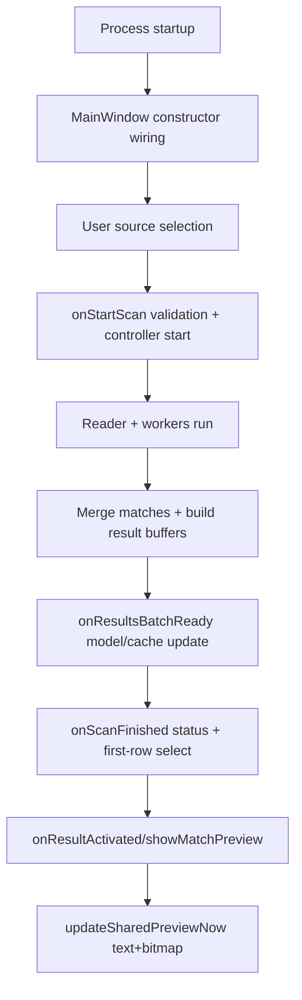

# Runtime Behavior (Current Implementation)

This document describes runtime behavior exactly as currently implemented.

## End-to-End Lifecycle

```mermaid
flowchart TD
startup["Process startup"] --> initUi["MainWindow constructor wiring"]
initUi --> sourceSelect["User source selection"]
sourceSelect --> startScan["onStartScan validation + controller start"]
startScan --> readerWorkers["Reader + workers run"]
readerWorkers --> mergeBuffers["Merge matches + build result buffers"]
mergeBuffers --> publishBatch["onResultsBatchReady model/cache update"]
publishBatch --> scanFinished["onScanFinished status + first-row select"]
scanFinished --> previewActivate["onResultActivated/showMatchPreview"]
previewActivate --> previewRender["updateSharedPreviewNow text+bitmap"]
```

## 1) Process Startup

1. `main()` (`src/main.cpp`) constructs `BrecoApplication`.
2. `main()` constructs `breco::MainWindow` and calls `show()`.
3. Qt event loop begins with `app.exec()`.

If selection tracing is enabled, `BrecoApplication::notify()` wraps event delivery, records event metadata, and logs:
- slow completions above `BRECO_EVENTTRACE_SLOW_MS` (default `50ms`)
- in-progress events at repeat interval `BRECO_EVENTTRACE_REPEAT_MS` (default `250ms`)

## 2) Main Window Construction and Wiring

`MainWindow::MainWindow()` (`src/app/MainWindow.cpp`) performs:

- UI host setup (`m_ui->setupUi(this)`)
- panel creation and layout embedding:
  - `ScanControlsPanel`
  - `ResultsTablePanel`
  - `TextViewPanel`
  - `CurrentByteInfoPanel`
  - `BitmapViewPanel`
  - `DataViewImagePanel`
- view widget creation:
  - `TextViewWidget`
  - `BitmapViewWidget`
- result table model attach (`ResultModel`)
- signal/slot wiring between controls, views, and scan controller
- initial defaults and persisted settings load from `AppSettings`
- summary/status initialization

Notable startup behavior:
- Worker-count control is populated from `1..QThread::idealThreadCount()`.
- Bitmap zoom initializes to `1x`.
- Image View Data defaults to all supported formats enabled, `From start of file`, main-scan worker count for Jobs, `4096 K` max pixels, and `5` max results.
- Shift defaults to bytes mode with value `0`.
- If file context later becomes single-file, `loadNotEmptyPreview()` can synthesize an initial row to display preview bytes before scanning.
- The last loaded struct declaration file is re-read when its path still names a file, so external declaration edits take effect on restart.
- A valid `/default EntryName` file directive selects that entry in the Struct
  dropdown when the declaration is parsed and takes precedence over a
  remembered entry selection during startup.
- After restoring a valid declaration and remembered single-file source, startup creates the selected struct preview automatically.

## 3) Source Selection

### Open file flow

`MainWindow::onOpenFile()`:

1. prompts file chooser with `AppSettings::lastFileDialogPath()`
2. calls `FileEnumerator::enumerateSingleFile()`
3. sets source mode + display text
4. rebuilds scan targets via `buildScanTargets()`
5. clears results/cache/hover/interval state
6. persists chosen path to `AppSettings`
7. refreshes summary labels
8. attempts `loadNotEmptyPreview()` for immediate single-file preview

### Open directory flow

`MainWindow::onOpenDirectory()`:

1. prompts directory chooser with `AppSettings::lastDirectoryDialogPath()`
2. calls `FileEnumerator::enumerateRecursive()`
3. sets source mode + display text
4. rebuilds scan targets via `buildScanTargets()`
5. clears results/cache/hover/interval state
6. persists chosen path to `AppSettings`
7. refreshes summary labels

`buildScanTargets()` filters entries to existing, readable regular files with `size > 0`.

## 4) Scan Start/Stop Lifecycle

### Start

`MainWindow::onStartScan()`:

- If scan is running, same button acts as stop and calls `onStopScan()`.
- Validates:
  - non-empty target set
  - non-empty UTF-8 search term from line edit
- Clears result/cache/hover state.
- Stores current shift config into `m_resultShiftSettings` (used for stable post-scan reloading).
- Calls `ScanController::startScan()` with:
  - targets
  - term
  - block size
  - worker count
  - text interpretation mode
  - ignore-case flag
  - shift settings
  - prefill-on-merge flag
  - scan button timestamp

### Stop

`MainWindow::onStopScan()` forwards to `ScanController::requestStop()`.

`ScanController::stopInternal()` sets atomic stop flag and notifies pending condition variable.

## 5) Scan Execution to UI Completion

1. `ScanController::startScan()` validates run preconditions (not already running, non-empty term, non-empty readable target list), spawns workers, starts reader thread, starts tick timer, emits `scanStarted`.
2. Reader thread (`ScanController::readerLoop()`) reads target data in blocks with overlap and dispatches jobs.
3. Worker completions update pending-buffer tracking and either take queued jobs or return to idle pool.
4. Timer tick (`ScanController::onTick()`) emits periodic progress and checks reader completion.
5. After reader done, controller joins threads, merges matches, builds buffers, emits one `resultsBatchReady` and then `scanFinished`.
6. `MainWindow::onResultsBatchReady()` imports result buffers/mapping, appends matches to model, enforces cache budget, rebuilds overlap intervals, prints merged count status.
7. `MainWindow::onScanFinished()` sets button back to `Scan`, writes completion status, and auto-selects first row if any results exist.

## 6) Result Selection and Preview Updates

Selection path:

1. table selection change -> `MainWindow::onResultActivated()`
2. validates row and match availability
3. updates bitmap overlap intervals when target changes
4. calls `showMatchPreview(row, match)`
5. `showMatchPreview()` sets active row + center, then runs `updateSharedPreviewNow()`

Preview update path (`updateSharedPreviewNow()`):

- Ensures active row buffer is present (`ensureRowBufferLoaded()`)
- Pulls mapped backing `ResultBuffer`
- Resolves center offset (pending requested center or current shared center), clamped to buffer bounds
- Computes text and bitmap centered spans based on each view capacity
- Builds byte slices for both views from a union range
- Updates widgets under recursion guard `m_previewSyncInProgress`:
  - text data + match range + selected offset
  - bitmap data + center anchor + highlight range
- refreshes hover buffers used for status-line decode output

Deferred update behavior:
- `scheduleSharedPreviewUpdate()` coalesces repeated triggers with `m_previewUpdateScheduled` and posts a queued lambda to avoid re-entrant immediate updates.

## 7) View Data Struct Preview

`StructVisualizedTreeModel` exposes five columns: `Name`, `Type`, `Value`,
`Bytes`, and `Valid`. `StructDataViewPanel` sizes `Name` to its contents and
stretches `Value` into remaining space.

Struct/object and scalar rows display their decoded type in `Type`; struct
rows keep `Value` empty. Repeat and array containers keep `Type` empty, while
their children display the element type. Container `Value` is `(empty)`,
`1 item`, or `N items`. Struct previews render as a top-level `Preview` row;
saved views use their editable list name and default to
`TypeName@0xHEX_OFFSET`. Single-repeat struct views hoist the synthetic
`StructName[0]` entry so the view row contains the struct fields directly.
Top-level views with multiple repeats remain containers over the typed
`StructName[N]` entries.

The Struct editor's persisted `Enable` checkbox defaults on. It remains
checked or unchecked while an invalid declaration disables the control.
When checked and the declaration is valid, Breco maintains the preview for
the selected entry. `Add previewed` is enabled exactly when those two
conditions hold and copies the current preview into `Views`.
Parse errors appear below the declaration editor as `Line N: message`, while
the corresponding source line remains highlighted. The status remains visible
without errors as `N lines, no errors`.

`Valid` is empty for ordinary complete nodes. It reports condition validity
for `/cond` fields and `/assert` nodes, and missing-byte counts for truncated
nodes, combining both when applicable. Passing conditional rows use light
green; failed conditional or truncated rows use light red. Odd rows use darker
variants of those colors, while unqualified complete rows retain the normal
alternating backgrounds. A condition or assertion error is shown in the
failing node's `Value` cell; containing struct rows keep an empty `Value`
instead of repeating the child error.

`/when` is evaluated before its field decodes. A false `/when` consumes zero
bytes and emits no tree node; a true `/when` decodes the field normally.
Bitfield members are display-only child rows under their scalar integer word
and do not advance the byte cursor.

Decoded nodes retain the absolute offset of their first byte, independent of
decode endianness, together with the number of source bytes they cover.
Clicking a tree item or saved `Views` row routes that source range through
`MainWindow::jumpToAbsoluteOffset()`, loading the source when necessary,
centering the hex view, and highlighting the range in the byte and bitmap
views without clearing an active struct preview for same-source navigation.
Clicking a decoded tree field also centers the Structure editor on its field
declaration and highlights that full line. Repeated containers and elements
map back to their repeated field line; top-level view rows map to the selected
type declaration.
Scrolling or reloading the hex viewport also preserves an active struct
preview. While `Enable` is checked, clicking a byte in the hex view decodes
or re-decodes the preview with the clicked byte as its new start offset.

Successful declaration-file loads persist the absolute path through
`AppSettings`. Startup prefers that file over the cached editor text when the
file still exists. Automatic preview creation requires `Enable`, a valid
restored declaration, and a successfully restored single-file source. The
`Views` and `Language` section checkboxes are persisted as well.

## 8) View Data Image Scans

`MainWindow::startImageScan()` builds an `EmbeddedImageScanRequest` from the active preview target and the Image mode controls.

Scopes:
- `From start of file`: scans the active target from byte `0`.
- `From Here`: scans inclusively from `TextViewWidget::selectedOffset()`, falling back to the first visible byte.
- `Only visible buffer`: scans a snapshot of `m_textHoverBuffer`.

The image scanner:
- runs through `EmbeddedImageScanController` on a `std::jthread`
- reads transformed windows with the current hex shift for file-wide scopes from a single coordinator thread
- shares each immutable chunk across configured worker jobs for signature scanning, then merges candidates deterministically and decodes them serially on the coordinator
- searches magic/text openers for PNG, TIFF/BigTIFF, JPEG, BMP, ICO, GIF, XPM, and SVG
- attempts TGA and XBM only at the chosen start offset
- rejects candidates over `maxPixelsK * 1000` pixels
- streams accepted image cards and progress updates while the scan is running
- stops at `maxresults` when it is positive; `maxresults == 0` is unlimited until EOF or Stop
- keeps partial live results when Stop cancels the scan
- retains each accepted image's encoded payload for format-aware right-click saving
- decodes all GIF frames, reports their count, and plays them with a minimum per-frame delay of `16 ms`

Hovering an image highlights its result card. Left-clicking calls `MainWindow::jumpToAbsoluteOffset()`, which reloads the active backing buffer around that offset if needed before centering the text/bitmap preview. Right-clicking opens a Save File dialog seeded with the detected format's extension and writes the retained encoded payload without flattening animated GIFs.

## 9) Hover/Status Behavior

- Text hover -> propagates to bitmap external hover, updates current-byte panel, and anchors text hover caret
- Bitmap hover -> updates current-byte panel and text hover anchor
- Hover leave -> clears external hover and current-byte panel
- Current-byte panel updates include:
  - ASCII / UTF-8 / UTF-16 glyph hints
  - signed+unsigned 8/16/32/64-bit interpretations
  - little-endian and big-endian reads where enough bytes are available
  - large char display with big-endian/little-endian char toggle
  - caption highlighting based on available width (1/2/4/8 bytes)
- Status bar output is lifecycle/capacity oriented (`Scanning...`, `Merged results: ...`, `Scan finished`, buffer residency line).
- Duplicate status lines are suppressed by `writeStatusLineToStdout()` using last-line memoization.

## Signal/Slot Flow Map

```mermaid
flowchart TD
uiOpenFile[OpenFileButton clicked] --> onOpenFile[MainWindow onOpenFile]
uiOpenDir[OpenDirButton clicked] --> onOpenDir[MainWindow onOpenDirectory]
uiScan[ScanButton clicked] --> onStartScan[MainWindow onStartScan]
scanStart[ScanController scanStarted] --> onScanStarted[MainWindow onScanStarted]
scanProgress[ScanController progressUpdated] --> onProgress[MainWindow onProgressUpdated]
scanBatch[ScanController resultsBatchReady] --> onBatch[MainWindow onResultsBatchReady]
scanDone[ScanController scanFinished] --> onDone[MainWindow onScanFinished]
scanErr[ScanController scanError] --> uiWarn[QMessageBox warning]
rowChanged[Results selection currentRowChanged] --> onActivate[MainWindow onResultActivated]
textHover[TextView hoverAbsoluteOffsetChanged] --> onTextHover[MainWindow onTextHoverOffsetChanged]
textCenter[TextView centerAnchorOffsetChanged] --> onTextCenter[MainWindow onTextCenterAnchorRequested]
bitmapHover[BitmapView hoverAbsoluteOffsetChanged] --> onBitmapHover[MainWindow onBitmapHoverOffsetChanged]
bitmapClick[BitmapView byteClicked] --> onBitmapClick[MainWindow onBitmapByteClicked]
imageScan[ImageScanButton clicked] --> onImageScan[MainWindow startImageScan/Stop toggle]
imageProgress[EmbeddedImageScanController progressUpdated] --> imageBars[DataViewImagePanel progress bars]
imageReady[EmbeddedImageScanController resultReady] --> imageResults[DataViewImagePanel live results]
imageDone[EmbeddedImageScanController scanFinished] --> imageDoneUi[DataViewImagePanel scan state]
imageClick[Image result clicked] --> imageJump[MainWindow jumpToAbsoluteOffset]
```

## Error Surface in Runtime Path

- User-facing modal errors:
  - `scanError` from `ScanController` is shown via `QMessageBox::warning`.
  - local validations in `onStartScan()` also use `QMessageBox::information`.
- Non-fatal operational warnings:
  - many I/O and partition issues log to `std::cerr` and continue/stop current target without process crash.

See `docs/scan-and-io-behavior.md` and `docs/preview-cache-and-status.md` for deeper mechanics.
