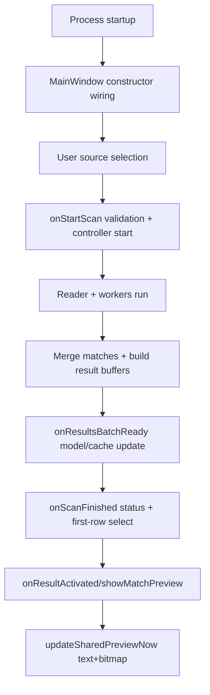

# Runtime Behavior (Current Implementation)

This document describes runtime behavior exactly as currently implemented.

## End-to-End Lifecycle

```mermaid
flowchart TD
startup["Process startup"] --> initUi["MainWindow constructor wiring"]
initUi --> sourceSelect["User source selection"]
sourceSelect --> startScan["onStartScan validation + controller start"]
startScan --> readerWorkers["Reader + workers run"]
readerWorkers --> mergeBuffers["Merge matches + build result buffers"]
mergeBuffers --> publishBatch["onResultsBatchReady model/cache update"]
publishBatch --> scanFinished["onScanFinished status + first-row select"]
scanFinished --> previewActivate["onResultActivated/showMatchPreview"]
previewActivate --> previewRender["updateSharedPreviewNow text+bitmap"]
```

## 1) Process Startup

1. `main()` (`src/main.cpp`) constructs `BrecoApplication`.
2. `main()` constructs `breco::MainWindow` and calls `show()`.
3. Qt event loop begins with `app.exec()`.

If selection tracing is enabled, `BrecoApplication::notify()` wraps event delivery, records event metadata, and logs:
- slow completions above `BRECO_EVENTTRACE_SLOW_MS` (default `50ms`)
- in-progress events at repeat interval `BRECO_EVENTTRACE_REPEAT_MS` (default `250ms`)

## 2) Main Window Construction and Wiring

`MainWindow::MainWindow()` (`src/app/MainWindow.cpp`) performs:

- UI host setup (`m_ui->setupUi(this)`)
- panel creation and layout embedding:
  - `ScanControlsPanel`
  - `ResultsTablePanel`
  - `TextViewPanel`
  - `CurrentByteInfoPanel`
  - `BitmapViewPanel`
  - `DataViewImagePanel`
- view widget creation:
  - `TextViewWidget`
  - `BitmapViewWidget`
- result table model attach (`ResultModel`)
- signal/slot wiring between controls, views, and scan controller
- initial defaults and persisted settings load from `AppSettings`
- summary/status initialization

Notable startup behavior:
- Worker-count control is populated from `1..QThread::idealThreadCount()`.
- Bitmap zoom initializes to `1x`.
- The Image tab defaults to all supported formats enabled, `From start of file`, main-scan worker count for Jobs, `4096 K` max pixels, and `5` max results.
- Shift defaults to bytes mode with value `0`.
- If file context later becomes single-file, `loadNotEmptyPreview()` can synthesize an initial row to display preview bytes before scanning.
- The last loaded `.breco` schema is re-read when its path still names a file,
  so external schema edits take effect on restart.
- A schema's `default entry` selects the initial entry.
- After restoring a valid schema and remembered single-file source, startup
  decodes the selected entry at the remembered offset.

## 3) Source Selection

### Open file flow

`MainWindow::onOpenFile()`:

1. prompts file chooser with `AppSettings::lastFileDialogPath()`
2. calls `FileEnumerator::enumerateSingleFile()`
3. sets source mode + display text
4. rebuilds scan targets via `buildScanTargets()`
5. clears results/cache/hover/interval state
6. persists chosen path to `AppSettings`
7. refreshes summary labels
8. attempts `loadNotEmptyPreview()` for immediate single-file preview

### Open directory flow

`MainWindow::onOpenDirectory()`:

1. prompts directory chooser with `AppSettings::lastDirectoryDialogPath()`
2. calls `FileEnumerator::enumerateRecursive()`
3. sets source mode + display text
4. rebuilds scan targets via `buildScanTargets()`
5. clears results/cache/hover/interval state
6. persists chosen path to `AppSettings`
7. refreshes summary labels

`buildScanTargets()` filters entries to existing, readable regular files with `size > 0`.

## 4) Scan Start/Stop Lifecycle

### Start

`MainWindow::onStartScan()`:

- If scan is running, same button acts as stop and calls `onStopScan()`.
- Validates:
  - non-empty target set
  - non-empty UTF-8 search term from line edit
- Clears result/cache/hover state.
- Stores current shift config into `m_resultShiftSettings` (used for stable post-scan reloading).
- Calls `ScanController::startScan()` with:
  - targets
  - term
  - block size
  - worker count
  - text interpretation mode
  - ignore-case flag
  - shift settings
  - prefill-on-merge flag
  - scan button timestamp

### Stop

`MainWindow::onStopScan()` forwards to `ScanController::requestStop()`.

`ScanController::stopInternal()` sets atomic stop flag and notifies pending condition variable.

## 5) Scan Execution to UI Completion

1. `ScanController::startScan()` validates run preconditions (not already running, non-empty term, non-empty readable target list), spawns workers, starts reader thread, starts tick timer, emits `scanStarted`.
2. Reader thread (`ScanController::readerLoop()`) reads target data in blocks with overlap and dispatches jobs.
3. Worker completions update pending-buffer tracking and either take queued jobs or return to idle pool.
4. Timer ticks check completion continuously and publish progress plus ordered result batches every two seconds.
5. Stop cancels queued jobs, drains active jobs, and preserves their partial matches.
6. After the reader is done, the controller flushes remaining results, reports the merging lifecycle state, rebuilds buffers, refreshes mappings, and emits `scanFinished`.
6. `MainWindow::onResultsBatchReady()` imports result buffers/mapping, appends matches to model, enforces cache budget, rebuilds overlap intervals, prints merged count status.
7. `MainWindow::onScanFinished()` sets button back to `Scan`, writes completion status, and auto-selects first row if any results exist.

## 6) Result Selection and Preview Updates

Selection path:

1. table selection change -> `MainWindow::onResultActivated()`
2. validates row and match availability
3. updates bitmap overlap intervals when target changes
4. calls `showMatchPreview(row, match)`
5. `showMatchPreview()` sets active row + center, then runs `updateSharedPreviewNow()`

Preview update path (`updateSharedPreviewNow()`):

- Ensures active row buffer is present (`ensureRowBufferLoaded()`)
- Pulls mapped backing `ResultBuffer`
- Resolves center offset (pending requested center or current shared center), clamped to buffer bounds
- Computes text and bitmap centered spans based on each view capacity
- Builds byte slices for both views from a union range
- Updates widgets under recursion guard `m_previewSyncInProgress`:
  - text data + match range + selected offset
  - bitmap data + center anchor + highlight range
- refreshes hover buffers used for status-line decode output

Deferred update behavior:
- `scheduleSharedPreviewUpdate()` coalesces repeated triggers with `m_previewUpdateScheduled` and posts a queued lambda to avoid re-entrant immediate updates.

## 7) BrecoLang Decode and Scan

The BrecoLang page is the application's only structured-decoding surface. A
debounced editor compiles source into an immutable program. The live view opens
bound inputs as paged sources and runs tree mode at the requested offset; only
the root level expands automatically. Pinned tabs retain their own program,
tree, input sources, entry, and offset.

Decoded nodes form a flat array with parent/child/sibling indices. The Qt model
shows name, type, value, input role, absolute source offset, and byte length.
Double-clicking a source-backed node selects its source range in the raw views.

JSON export replays the active entry in streaming mode. Binary export follows
the selected node's storage spans. Outforms use the active immutable tree and
source bindings. GUI file exports use staged writes and commit only on success.

Schema scans pass a compiled program and input bindings to the normal scan
controller. Each worker substitutes the scan target for the entry's primary
input and opens other inputs independently. It invokes probe mode at candidate
offsets, so successful matches retain full language semantics without node
construction.

The schema library indexes `.breco` files. Older schema files are detected only
to display a migration notice and are never loaded, changed, or removed.

## 8) Image Tab Scans

`MainWindow::startImageScan()` builds an `EmbeddedImageScanRequest` from the active preview target and the Image mode controls.

Scopes:
- `From start of file`: scans the active target from byte `0`.
- `From Here`: scans inclusively from `TextViewWidget::selectedOffset()`, falling back to the first visible byte.
- `Only visible buffer`: scans a snapshot of `m_textHoverBuffer`.

The image scanner:
- runs through `EmbeddedImageScanController` on a `std::jthread`
- reads transformed windows with the current hex shift for file-wide scopes from a single coordinator thread
- shares each immutable chunk across configured worker jobs for signature scanning, then merges candidates deterministically and decodes them serially on the coordinator
- searches magic/text openers for PNG, TIFF/BigTIFF, JPEG, BMP, ICO, GIF, XPM, and SVG
- attempts TGA and XBM only at the chosen start offset
- rejects candidates over `maxPixelsK * 1000` pixels
- streams accepted image cards and progress updates while the scan is running
- stops at `maxresults` when it is positive; `maxresults == 0` is unlimited until EOF or Stop
- keeps partial live results when Stop cancels the scan
- retains each accepted image's encoded payload for format-aware right-click saving
- decodes all GIF frames, reports their count, and plays them with a minimum per-frame delay of `16 ms`

Hovering an image highlights its result card. Left-clicking calls `MainWindow::jumpToAbsoluteOffset()`, which reloads the active backing buffer around that offset if needed before centering the text/bitmap preview. Right-clicking opens a Save File dialog seeded with the detected format's extension and writes the retained encoded payload without flattening animated GIFs.

## 9) Hover/Status Behavior

- Text hover -> propagates to bitmap external hover, updates current-byte panel, and anchors text hover caret
- Bitmap hover -> updates current-byte panel and text hover anchor
- Hover leave -> clears external hover and current-byte panel
- Current-byte panel updates include:
  - ASCII / UTF-8 / UTF-16 glyph hints
  - signed+unsigned 8/16/32/64-bit interpretations
  - little-endian and big-endian reads where enough bytes are available
  - large char display with big-endian/little-endian char toggle
  - caption highlighting based on available width (1/2/4/8 bytes)
- Status output is lifecycle/capacity oriented (structured `[scan] started`, live result-count,
  merging, and finished messages, plus the buffer residency line).
- Duplicate status lines are suppressed by `writeStatusLineToStdout()` using last-line memoization.

## Signal/Slot Flow Map

```mermaid
flowchart TD
uiOpenFile[OpenFileButton clicked] --> onOpenFile[MainWindow onOpenFile]
uiOpenDir[OpenDirButton clicked] --> onOpenDir[MainWindow onOpenDirectory]
uiScan[ScanButton clicked] --> onStartScan[MainWindow onStartScan]
scanStart[ScanController scanStarted] --> onScanStarted[MainWindow onScanStarted]
scanProgress[ScanController progressUpdated] --> onProgress[MainWindow onProgressUpdated]
scanBatch[ScanController resultsBatchReady] --> onBatch[MainWindow onResultsBatchReady]
scanDone[ScanController scanFinished] --> onDone[MainWindow onScanFinished]
scanErr[ScanController scanError] --> uiWarn[QMessageBox warning]
rowChanged[Results selection currentRowChanged] --> onActivate[MainWindow onResultActivated]
textHover[TextView hoverAbsoluteOffsetChanged] --> onTextHover[MainWindow onTextHoverOffsetChanged]
textCenter[TextView centerAnchorOffsetChanged] --> onTextCenter[MainWindow onTextCenterAnchorRequested]
bitmapHover[BitmapView hoverAbsoluteOffsetChanged] --> onBitmapHover[MainWindow onBitmapHoverOffsetChanged]
bitmapClick[BitmapView byteClicked] --> onBitmapClick[MainWindow onBitmapByteClicked]
imageScan[ImageScanButton clicked] --> onImageScan[MainWindow startImageScan/Stop toggle]
imageProgress[EmbeddedImageScanController progressUpdated] --> imageBars[DataViewImagePanel progress bars]
imageReady[EmbeddedImageScanController resultReady] --> imageResults[DataViewImagePanel live results]
imageDone[EmbeddedImageScanController scanFinished] --> imageDoneUi[DataViewImagePanel scan state]
imageClick[Image result clicked] --> imageJump[MainWindow jumpToAbsoluteOffset]
```

## Error Surface in Runtime Path

- User-facing modal errors:
  - `scanError` from `ScanController` is shown via `QMessageBox::warning`.
  - local validations in `onStartScan()` also use `QMessageBox::information`.
- Non-fatal operational warnings:
  - many I/O and partition issues log to `std::cerr` and continue/stop current target without process crash.

See `docs/scan-and-io-behavior.md` and `docs/preview-cache-and-status.md` for deeper mechanics.
