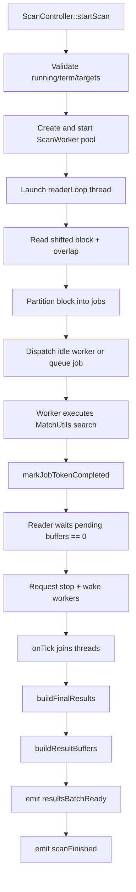
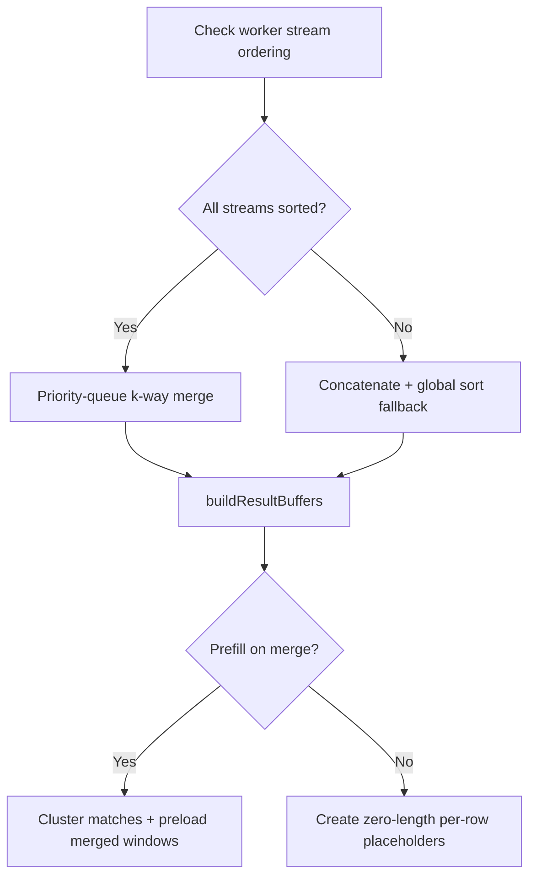

# Scan and I/O Behavior (Current Implementation)

This document captures scanning and file I/O behavior as currently implemented.

## ScanController Runtime Model

`ScanController` (`src/scan/ScanController.{h,cpp}`) uses:

- one reader thread (`readerLoop()`)
- `N` worker threads (`ScanWorker`)
- Qt timer (`m_tickTimer`, 100ms) on main thread for progress + completion checks
- several synchronization structures:
  - idle worker deque (`m_idleWorkers`)
  - queued jobs deque (`m_queuedJobs`)
  - pending buffer tracker (`m_pendingBufferCount`, `m_bufferJobsRemaining`, `m_pendingCv`)

The controller emits Qt signals to `MainWindow`:
- `scanStarted(fileCount, totalBytes)`
- `progressUpdated(scannedBytes, totalBytes)`
- `resultsBatchReady(matches, mergedTotal)`
- `scanFinished(stoppedByUser, autoStoppedLimitExceeded)`
- `scanError(message)`

## Scan Start Preconditions and Configuration

`ScanController::startScan()` hard-stops early (signal error + return) when:
- scan already running
- search term empty
- no readable targets after filtering (`filePath` empty or `fileSize == 0` removed)

Configuration normalization:
- block size is clamped to at least `1`
- worker count falls back to `max(1, QThread::idealThreadCount())` when non-positive
- scan start timestamp defaults to `steady_clock::now()` when caller passes default

## Reader Loop, Blocking, and Partitioning

`readerLoop()` behavior:

1. Computes overlap: `searchTerm.size() - 1` (or 0 if term empty, though start preconditions enforce non-empty).
2. Limits in-flight buffers by `maxPendingBuffers = max(1, workerCount * 2)`.
3. Iterates targets and file offsets in block increments.
4. For each block:
   - `primarySize = min(blockSize, remainingFileBytes)`
   - `outputSize = primarySize + overlap` except final chunk where no forward overlap is possible
   - reads raw shifted window via `ShiftedWindowLoader::loadRawWindow(...)`
5. Splits each block into up to `workerCount * 2` jobs:
   - each job reports only `job.reportLimit` primary bytes
   - each job may carry trailing overlap in `job.size`
6. Validates partition consistency and logs warning on invalid layout.
7. Dispatches jobs immediately when idle workers exist; otherwise queues jobs.
8. Tracks completion with buffer token accounting; reader waits for all pending buffers before signaling done.

Important implementation detail:
- a read failure (`loadRawWindow` returns no value) logs warning and breaks current target processing loop; it does not crash the app.

## Worker Completion and Dispatch Backpressure

Worker completion callback (`onJobComplete` lambda in `startScan()`):

- marks buffer token progress via `markJobTokenCompleted()`
- tries to pop one queued job and immediately reassign to the same worker
- if none queued, worker returns to idle deque and idle counter increments
- invalid worker IDs are warned and skipped safely

Backpressure is handled at two levels:
- `readerLoop()` blocks when pending buffers reach configured ceiling
- queued jobs absorb temporary worker unavailability

## Completion, Merge, and Result Buffer Build

`onTick()` finalization sequence once `m_readerDone` is true:

1. stop timer
2. join reader + workers
3. run `buildFinalResults()`
4. emit final `resultsBatchReady(...)` (single merged batch)
5. emit `scanFinished(...)`

### `buildFinalResults()` merge behavior

- verifies each worker stream ordering (`scanTargetIdx`, then `offset`, then `threadId`)
- if any stream is unsorted:
  - logs warning
  - concatenates all matches
  - global sort fallback
- if streams are sorted:
  - uses priority-queue k-way merge over worker cursors

### `buildResultBuffers()` behavior

Two modes controlled by `m_prefillOnMerge`:

- `false`:
  - creates one zero-length `ResultBuffer` per match
  - defers actual bytes to later on-demand loading
- `true`:
  - clusters nearby matches per target and preloads merged windows
  - constants:
    - merge gap `kMergeGapBytes = 16 MiB`
    - padding `kResultPaddingBytes = 8 MiB`
    - max buffer cap `kMaxResultBufferBytes = 128 MiB`
  - each cluster becomes one `ResultBuffer`
  - `m_matchBufferIndices` maps each match row to buffer index

## I/O Subsystem Details

## File Enumeration

`FileEnumerator` (`src/io/FileEnumerator.cpp`):
- single-file path route for open-file flow
- recursive route for open-directory flow

`MainWindow::buildScanTargets()` performs final admissibility filter:
- exists
- is regular file
- is readable
- size > 0

## OpenFilePool

`OpenFilePool` (`src/io/OpenFilePool.cpp`) behavior:

- thread-local bucket of open handles
- per-thread LRU bounded by max-open setting (default constructor path)
- `readChunk(path, offset, size)` returns `std::optional<QByteArray>`
- guard rails:
  - rejects empty path
  - rejects overflow/invalid offsets and sizes
  - returns `nullopt` on open/seek/read failure
- exposes cleanup methods used by scan lifecycle:
  - `clearThreadLocal()` after reader completes
  - `clearAll()` on runtime state reset

## ShiftedWindowLoader

`ShiftedWindowLoader` (`src/io/ShiftedWindowLoader.cpp`) handles:

- `loadRawWindow(...)`: resolves read plan from requested output range and shift settings
- `loadTransformedWindow(...)`: applies transform to produce logical shifted output

Fast path:
- if shift amount is zero and read range matches output range, transformed path avoids extra transform work.

## Stop and Cleanup Semantics

- `requestStop()` triggers `stopInternal(true)`:
  - sets atomic stop flag
  - marks user-stop state
  - wakes waiters
- reader thread checks stop flag and exits loop
- completion path still performs orderly joins and emits `scanFinished(stoppedByUser=true, ...)`

Destructor semantics:
- `ScanController::~ScanController()` calls `requestStop()` then `joinReaderAndWorkers()` to avoid orphan threads.

## Error Handling Matrix (As Implemented)

- Blocking/user-visible errors (`scanError`):
  - scan already running
  - empty search term
  - no readable files to scan
- Non-fatal warnings to stderr/stdout:
  - read failures by chunk
  - invalid job partitioning
  - invalid worker id callback
  - unsorted worker stream fallback
- Outcome:
  - app remains alive
  - scan may complete partially depending on which files/chunks failed

## Practical Implications

- Throughput scales with worker count, but pending-buffer cap and queued jobs govern memory pressure.
- Result prefill mode heavily affects merge-time memory and later preview latency.
- Shifted reads are first-class in scan and preview paths, so byte offsets shown in UI are based on transformed output windows rather than raw unshifted slices.
